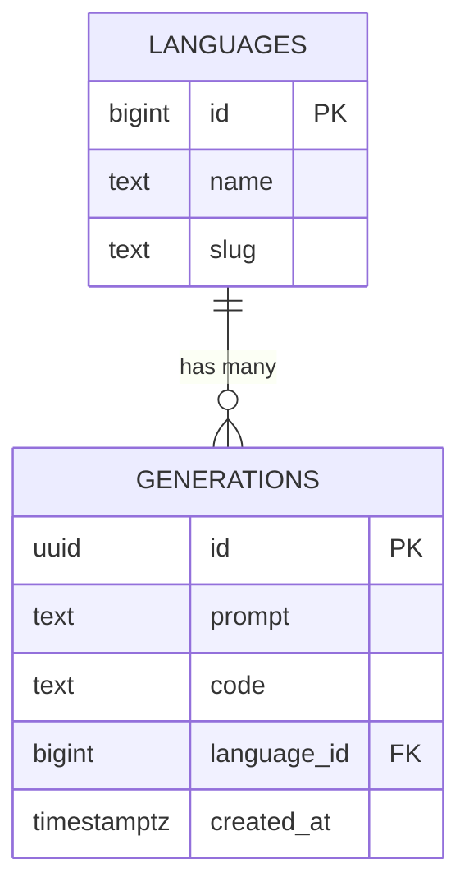

# Database Schema

## ER Diagram

## Tables

### `languages`
Stores supported programming languages.
- `id`: Primary Key.
- `name`: Display name (e.g., "Python").
- `slug`: Identifier for API/URL (e.g., "python").

### `generations`
Stores the history of generated code.
- `id`: Primary Key (UUID).
- `prompt`: The user's input prompt.
- `code`: The generated code.
- `language_id`: Foreign Key referencing `languages.id`.
- `created_at`: Timestamp of generation.

## Indexes
- `languages(slug)`: Unique index for fast lookup by slug.
- `generations(created_at)`: Implicitly useful for sorting by date (though a specific index might be added if volume grows).
